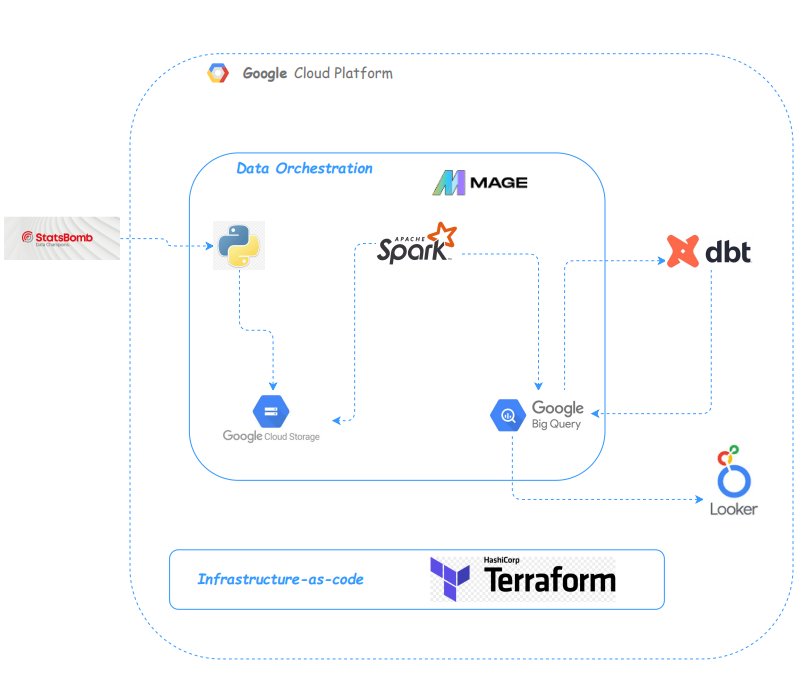
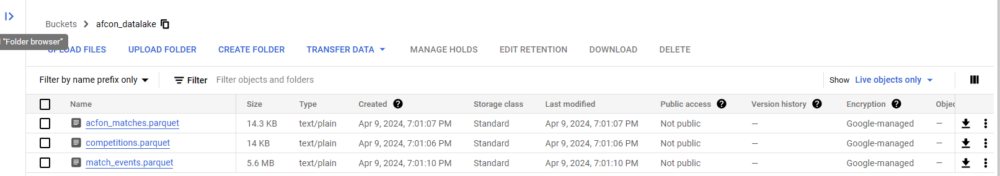
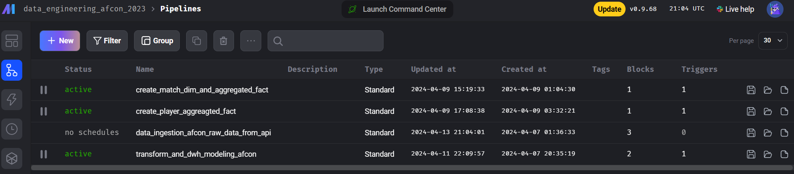
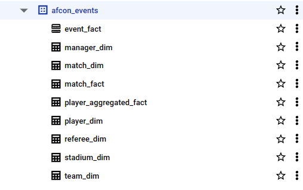

# Africa cup of nations dashboard (2023)

# What's case about? (Problem describtion)

Talented players catch the eyes of many European, Latin, and African managers    during the Africa Cup of Nations (AFCON) tournaments. Occurring every two years, these tournaments consistently produce previously unheard-of talent, giving managers an advantage in scouting for players to join one of the top five leagues, such as the Premier League. We provide analytics and statistics on all players during the tournaments, along with comprehensive statistics total matches played throughout the tournament.

# Technology Stack

- Google Cloud Platform (GCP)
    - **Compute Engine**: Hosting VM instance.
    - **Google Cloud Storage (Datalake)**: Where data lands.
    - **BigQuery (Datawarehouse)**: Where data is stored in dimensional modeling.
    - **Spark (Data Processing Layer)**: Local cluster on VM instance.

- Mage
    - **Orchestration Tool**: Used for our data pipeline flow.

- DBT (Data Build Tool)
    - **Reporting Layer**: Built in models.

- Docker
    - **Containerization**: Wrapping Mage and Spark in containers.

- Terraform (Infrastructure as Code)
    - **Deployment**: Used to deploy all the needed resources on GCP.

# Data Pipeline Flow

As shown in image our data flow consists of below section:

1. Data Ingestion:

    - Landing the raw data which fetched from statsbomb API into google cloud storage into 3 parquet format files.
        - types of files: 
            - file for all competitions that statsbomb captured.
            - file for all matches played in afcon 2023.
            - file for all events happend during the tournment.

2. Data Processing:

    - Utilizing Spark capabilities, we aim to transform raw data and address any issues encountered, ensuring its compatibility with the data warehouse model. We will establish three pipelines using PySpark, managing and scheduling their execution through Mage as our orchestration tool

3. Data Storage:

    - After transforming the raw data using Spark pipelines, the transformed data will be loaded into tables structured according to the galaxy schema model in BigQuery. This galaxy schema model includes multiple interconnected fact and dimension tables designed to support efficient querying and analysis of the data (Details below). 

4. Data Modeling:
    - After transforming and loading the data into BigQuery using Spark pipelines, we utilize the Data Build Tool (dbt) to combine or join the dimension tables with the fact tables. This process generates specific reporting tables in another schema within BigQuery. These reporting tables are optimized for querying and analysis, providing insights into various aspects of the data.

5. Data Visualization:
    - After generating specific reporting tables in BigQuery using dbt, we leverage Google Looker Studio to provide insights and visualizations. Looker Studio allows us to create interactive dashboards and reports, enabling users to gain valuable insights from the data stored in BigQuery. Through Looker Studio, stakeholders can explore and analyze the data efficiently, facilitating data-driven decision-making processes.