# Africa cup of nations analytics (2023)

### What's case about? (Problem describtion)

- Talented players catch the eyes of many European, Latin, and African managers    during the Africa Cup of Nations (AFCON) tournaments. Occurring every two years, these tournaments consistently produce previously unheard-of talent, giving managers an advantage in scouting for players to join one of the top five leagues, such as the Premier League. We provide analytics and statistics on all players during the tournaments, along with comprehensive statistics total matches played throughout the tournament.

### Technology Stack

- **Google Cloud Platform** (GCP)
    - **Compute Engine**: Hosting VM instance.
    - **Google Cloud Storage (Datalake)**: Where data lands.
    - **BigQuery (Datawarehouse)**: Where data is stored in dimensional modeling.
    - **Spark (Data Processing Layer)**: Local cluster on VM instance.

- **Mage**
    - **Orchestration Tool**: Used for our data pipeline flow.

- **DBT** (Data Build Tool)
    - **Reporting Layer**: Built in models.

- **Docker**
    - **Containerization**: Wrapping Mage and Spark in containers.

- **Terraform** (Infrastructure as Code)
    - **Deployment**: Used to deploy all the needed resources on GCP.

### Data Pipeline Flow

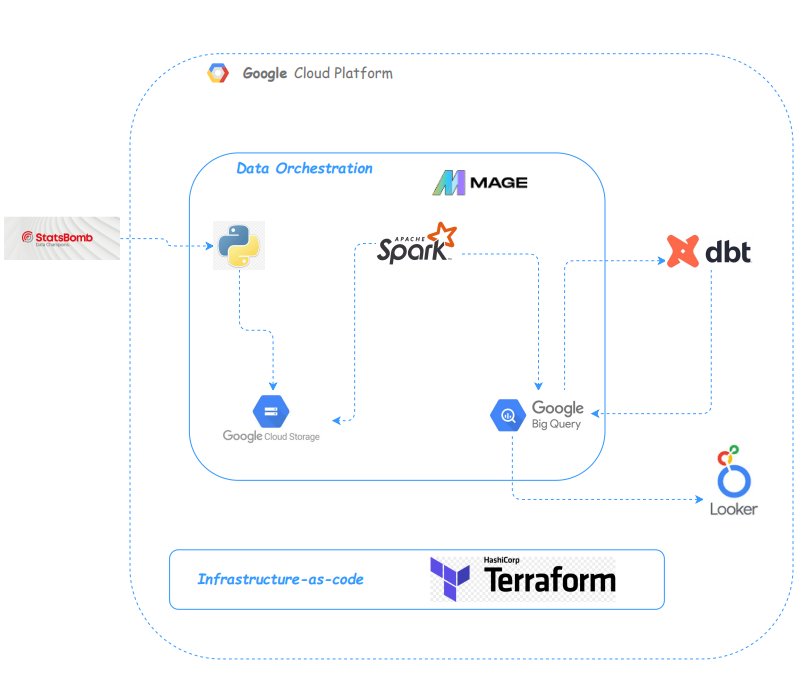

As shown in image our data flow consists of below section:

**1. Data Ingestion**:
- Landing the raw data which fetched from statsbomb API into google cloud storage into 3 parquet format files.
    - types of files: 
        - file for all competitions that statsbomb captured.
        - file for all matches played in afcon 2023.
        - file for all events happend during the tournment.

**2. Data Processing**:

-   Utilizing Spark capabilities, we aim to transform raw data and address any issues encountered, ensuring its compatibility with the data warehouse model. We will establish three pipelines using PySpark, managing and scheduling their execution through Mage as our orchestration tool.

**3. Data Storage**:

- After transforming the raw data using Spark pipelines, the transformed data will be loaded into tables structured according to the galaxy schema model in BigQuery. This galaxy schema model includes multiple interconnected fact and dimension tables designed to support efficient querying and analysis of the data (Details below). 

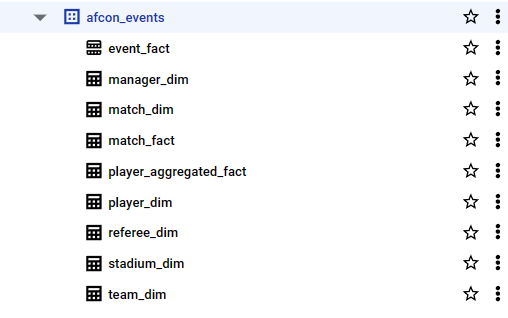

**4. Data Modeling**:

-   After transforming and loading the data into BigQuery using Spark pipelines, we utilize the Data Build Tool (dbt) to combine or join the dimension tables with the fact tables. This process generates specific reporting tables in another schema within BigQuery. These reporting tables are optimized for querying and analysis, providing insights into various aspects of the data.

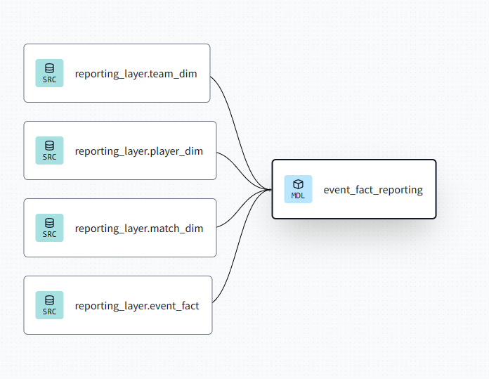

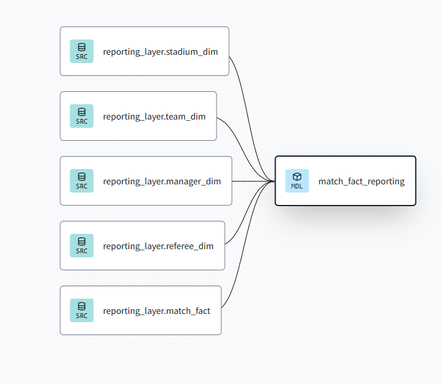

**5. Data Visualization**:

-   After generating specific reporting tables in BigQuery using dbt, we leverage Google Looker Studio to provide insights and visualizations. Looker Studio allows us to create interactive dashboards and reports, enabling users to gain valuable insights from the data stored in BigQuery. Through Looker Studio, stakeholders can explore and analyze the data efficiently, facilitating data-driven decision-making processes.

### Datawarehouse Modeling

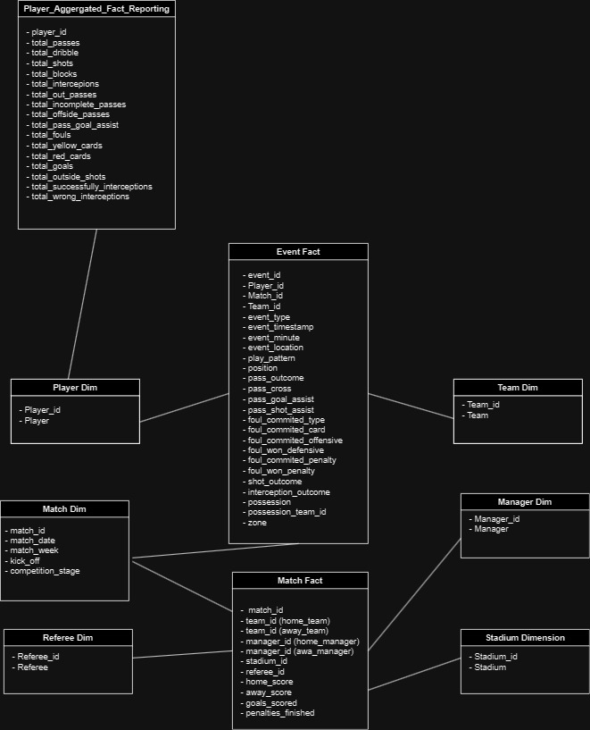

- When analyzing the case, we discovered that we deal with different levels of granularity, namely the grain for events, matches, and players. Therefore, I decided to utilize the Galaxy Schema model. Unlike the Star Schema and Snowflake Schema, the Galaxy Schema employs multiple fact tables connected with shared normalized dimension tables. The Galaxy Schema can be likened to a star schema that is interlinked and fully normalized, thus avoiding any redundancy or inconsistency of data.

### Getting Started

**1. clone the repo:**

    git clone https://github.com/Abdol74/AFCON_2023_DE_Stats.git

### Setup GCP environment:

**2. Create your GCP project**:

    https://cloud.google.com/resource-manager/docs/creating-managing-projects

**3. Create your GCP service account and save the key into your VM instance:**

- Give the service account the following roles:
    - BigQuery Admin
    - BigQuery Data Editor
    - BigQuery Data Owner
    - BigQuery Job User
    - BigQuery User
    - Compute Admin
    - Storage Admin

**4. Connect to VM instance:**

- Get the external IP of VM from google cloud interface.
- Create directory in your local machine called .ssh 
- paste the private and public key you got them when create the VM instance
- Create file called config and edit it with the next instructions:

    -   Host "Name_of_vm_instance"

    -   HostName "external_ip_of_vm_instance"

    -    User "your_user"

    -   IdentityFile "path_to_your_public_key"

- connect to the vm instance using the host:

    - ssh "Name_of_vm_instance"

**5. Dealing with Terraform:**
- Replace the value of the credentials variable with the path to your key in the variables.tf file. Then, execute the following commands:

        cd terraform

        terraform init

        terraform apply

**6. Launch our mage-spark image:**

    cd images/mage-spark

    rename dev.env to .env
    
    docker compose build

    docker-compose up -d

**7. Run the workflow:**

- Go to the Mage interface: http://localhost:6789.

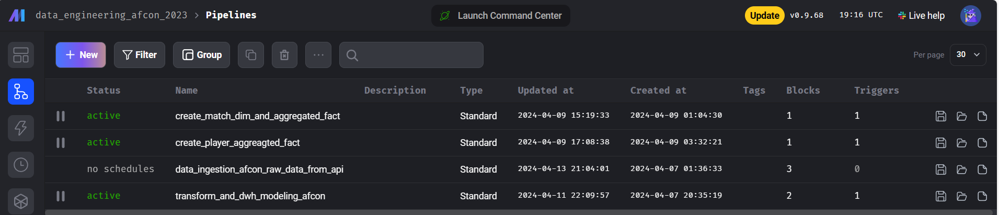

- As you can see, our workflow consists of 4 pipelines.

- Simply navigate to the first pipeline named "data_ingestion_afcon_raw_data_from_api".
- Click "run once" and the other pipelines will be triggered automatically.

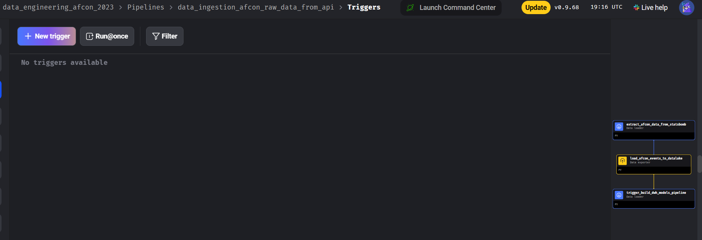

- After 15 minutes, go to BigQuery and you'll discover that all dimensions and facts are populated with the data.

**8. Destroy the GCP resources:**

    cd terraform

    terraform destroy 

**8. Explore the Dashboard:**

 - We published 2 reports on Looker Studio to discover them:

    - Explore [Match Dashboard](https://lookerstudio.google.com/reporting/0ced8dfa-cf0e-4c69-ae6f-16703cfaca2c/page/KPfwD)

    - Explore [Player Dashboard](https://lookerstudio.google.com/reporting/4193639b-ecd7-42c0-aa59-2d0c30e83eea/page/NmfwD)

- Some screenshots from the dashboards to get you the full knowledge

    - Here are the complete statistics for the total number of matches played, including total goals scored and top-scoring teams, among other metrics. 

    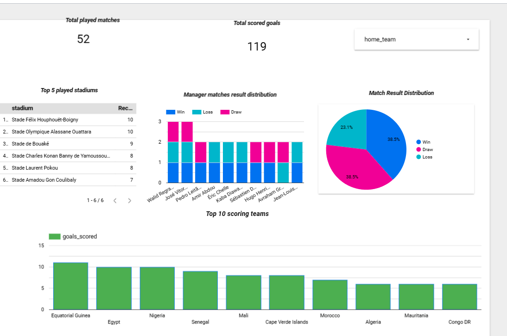

    - You can explore the comprehensive statistics for your preferred team by utilizing the filtration options.

    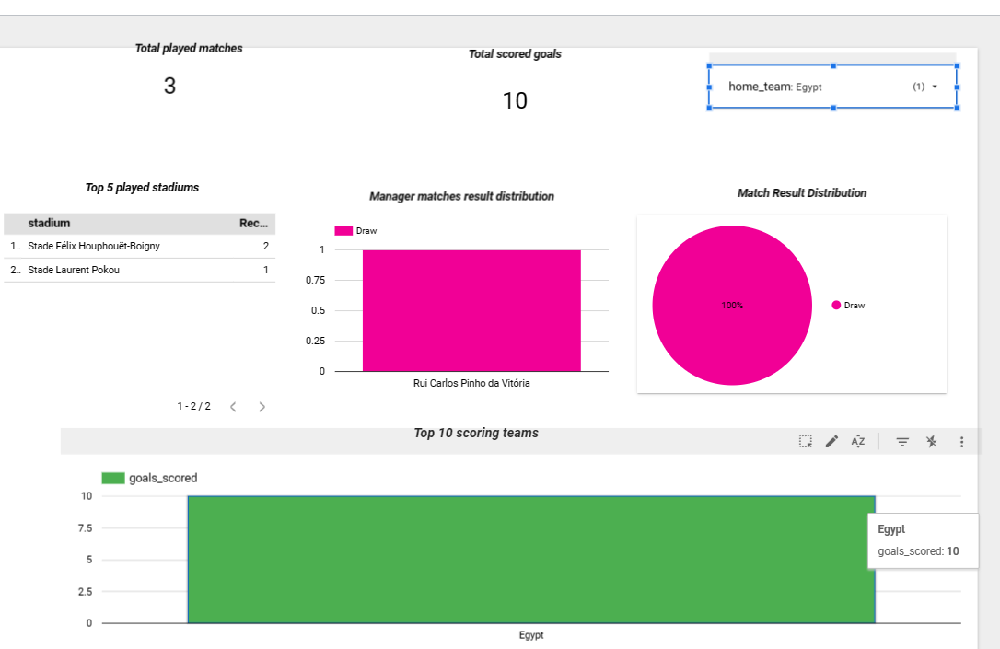

    - Utilizing the player dashboard filtration, you can compare the statistics of two or more players during the tournament. For instance, you can analyze the differences between SALAH and MANE.

    

    

    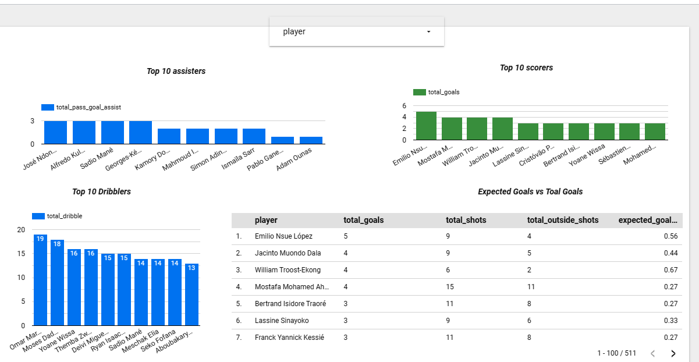

    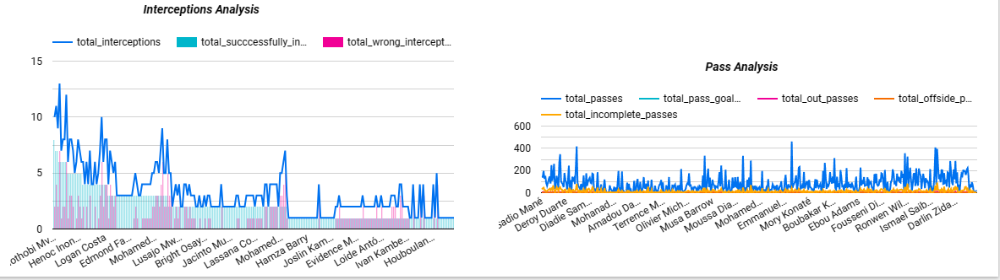

    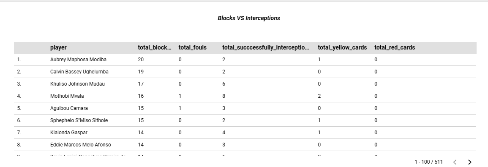
